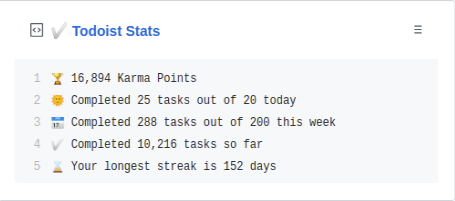

  
  <h3 align="center">todoist-box</h3>
  
Update a pinned gist to contain your Todoist stats

---

> 📌✨ For more pinned-gist projects like this one, check out: https://github.com/matchai/awesome-pinned-gists

## Setup

### Prep work

1. Create a new public GitHub Gist (https://gist.github.com/)
1. Create a token with the `gist` scope and copy it. (https://github.com/settings/tokens/new)
1. Create a Todoist account (https://todoist.com/users/showregister)
1. In your account settings, copy the existing Todoist API Token (https://beta.todoist.com/prefs/integrations)

### Project setup

1. Fork this repo
1. Go to the repo **Settings > Secrets**
1. Add the following environment variables:
   - **GH_TOKEN:** The GitHub token generated above.
   - **GIST_ID:** The ID portion from your gist url: `https://gist.github.com/yg/`**`a582ad10a45dc17815feea6018223880`**.
   - **TODOIST_API_KEY:** The API token for your Todoist account.

## License

MIT © [Yogi](LICENSE)
